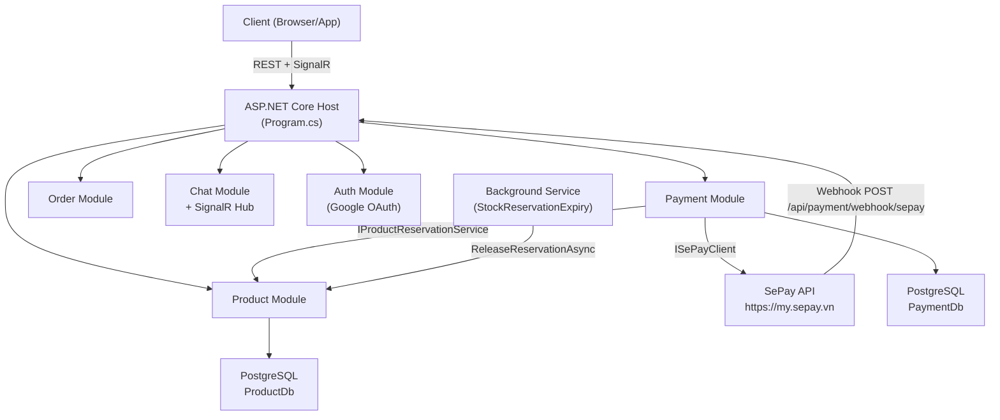
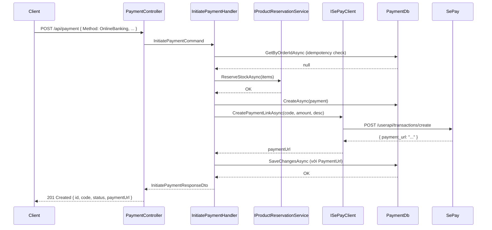
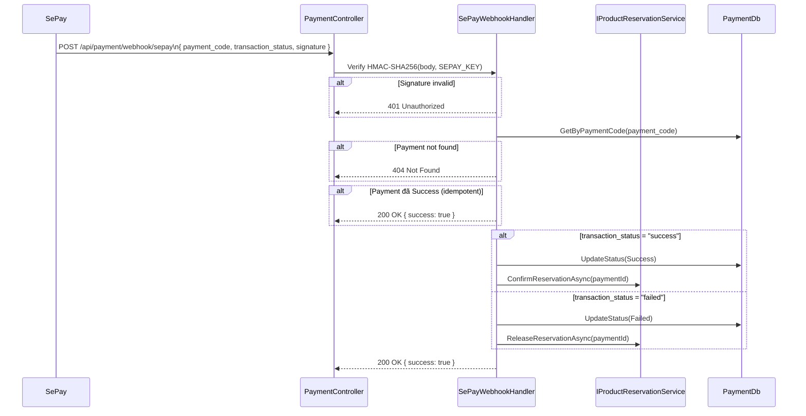
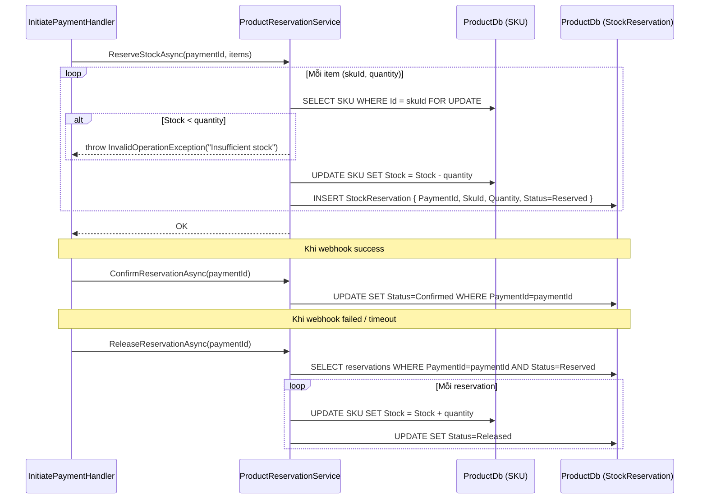

# Design Document: Payment SePay Integration

## Tổng quan

Tài liệu này mô tả thiết kế kỹ thuật cho việc nâng cấp hệ thống E-Verland, bao gồm: chuẩn hóa lowercase endpoints, refactor Payment module, tích hợp cổng thanh toán SePay, cơ chế stock reservation, bổ sung SignalR cho Chat, và sửa lỗi Google OAuth.

Hệ thống sử dụng kiến trúc module-based với CQRS (MediatR), PostgreSQL (Neon), Redis, deploy trên Azure App Service (.NET 10).

---

## Kiến trúc tổng thể



---

## 1. Lowercase API Endpoints

### Thay đổi

**File sửa:** `Host/Program.cs`

Thêm vào trước `builder.Build()`:

```csharp
builder.Services.Configure<RouteOptions>(o =>
{
    o.LowercaseUrls = true;
    o.LowercaseQueryStrings = true;
});
```

Tất cả controller dùng `[Route("api/[controller]")]` sẽ tự resolve lowercase. Không cần sửa từng controller.

### Kết quả endpoint mapping

| Controller        | Route hiện tại | Route sau khi fix |
| ----------------- | -------------- | ----------------- |
| PaymentController | `api/Payment`  | `api/payment`     |
| ProductController | `api/Product`  | `api/product`     |
| CartController    | `api/Cart`     | `api/cart`        |
| OrderController   | `api/Order`    | `api/order`       |
| ChatController    | `api/Chat`     | `api/chat`        |

---

## 2. Refactor Payment Module

### Vấn đề hiện tại

- `CreatePayment.cs` và `ProcessPayment.cs` có logic gần như giống nhau (duplicate code generation, duplicate idempotency check)
- `CreatePayment.cs` hardcode `Method = PaymentMethod.COD`
- Không có `PaymentUrl` field trên entity
- Không có abstraction cho SePay API call

### Cấu trúc file sau refactor

```
Modules/Payment/
├── Domain/
│   ├── Payment.cs                          ← THÊM PaymentUrl field
│   ├── EnumStatus.cs                       ← giữ nguyên
├── Application/
│   ├── Commands/
│   │   ├── InitiatePayment.cs              ← TẠO MỚI (thay thế Create + Process)
│   │   ├── UpdatePaymentStatus.cs          ← giữ nguyên
│   │   ├── CreatePayment.cs                ← XÓA
│   │   └── ProcessPayment.cs               ← XÓA
│   ├── Contracts/
│   │   ├── IPaymentRepository.cs           ← giữ nguyên
│   │   ├── IPaymentDbContext.cs            ← giữ nguyên
│   │   └── ISePayClient.cs                 ← TẠO MỚI
│   └── Helpers/
│       └── PaymentCodeHelper.cs            ← TẠO MỚI
├── Infrastructure/
│   ├── Persistence/
│   │   ├── PaymentDbContext.cs             ← THÊM PaymentUrl mapping
│   │   └── PaymentModule.cs               ← THÊM ISePayClient registration
│   └── Services/
│       └── SePayClient.cs                  ← TẠO MỚI
└── Api/
    └── Controllers/
        └── PaymentController.cs            ← SỬA: dùng InitiatePaymentCommand, thêm webhook/sepay
```

### Data Model: Payment entity (cập nhật)

```csharp
public class Payment : BaseEntity
{
    public string Code { get; set; } = null!;
    public Guid OrderId { get; set; }
    public Guid UserId { get; set; }
    public decimal Amount { get; set; }
    public PaymentMethod Method { get; set; }
    public PaymentStatus Status { get; set; }
    public string? PaymentUrl { get; set; }   // THÊM MỚI - URL redirect SePay
}
```

### Interface: ISePayClient

```csharp
// Modules/Payment/Application/Contracts/ISePayClient.cs
public interface ISePayClient
{
    Task<string?> CreatePaymentLinkAsync(
        string paymentCode,
        decimal amount,
        string description,
        CancellationToken ct = default);
}
```

### Helper: PaymentCodeHelper

```csharp
// Modules/Payment/Application/Helpers/PaymentCodeHelper.cs
public static class PaymentCodeHelper
{
    public static string Generate()
        => $"PAY-{DateTime.UtcNow:yyyyMMdd}-{Random.Shared.Next(100000, 999999)}";
}
```

### Command: InitiatePaymentCommand

```csharp
// Modules/Payment/Application/Commands/InitiatePayment.cs
public sealed record InitiatePaymentCommand(
    Guid OrderId,
    Guid UserId,
    decimal Amount,
    PaymentMethod Method,
    List<OrderItemDto> Items   // cần để gọi ReserveStockAsync
) : IRequest<InitiatePaymentResponseDto>;

public sealed record InitiatePaymentResponseDto(
    Guid Id,
    string Code,
    PaymentStatus Status,
    string? PaymentUrl
);
```

---

## 3. Tích hợp SePay

### Sequence diagram: Tạo payment OnlineBanking



### Sequence diagram: Xử lý SePay Webhook



### SePayClient implementation

```csharp
// Modules/Payment/Infrastructure/Services/SePayClient.cs
public class SePayClient : ISePayClient
{
    private readonly HttpClient _http;
    private const string BaseUrl = "https://my.sepay.vn/userapi";

    public SePayClient(HttpClient http)
    {
        _http = http;
        var apiKey = Environment.GetEnvironmentVariable("SEPAY_API")
            ?? throw new InvalidOperationException("Missing SEPAY_API env var");
        _http.DefaultRequestHeaders.Authorization =
            new AuthenticationHeaderValue("Apikey", apiKey);
    }

    public async Task<string?> CreatePaymentLinkAsync(
        string paymentCode, decimal amount, string description, CancellationToken ct = default)
    {
        var payload = new { payment_code = paymentCode, amount, description };
        var response = await _http.PostAsJsonAsync($"{BaseUrl}/transactions/create", payload, ct);
        response.EnsureSuccessStatusCode();
        var result = await response.Content.ReadFromJsonAsync<SePayResponse>(ct);
        return result?.PaymentUrl;
    }
}
```

### Webhook endpoint mới

```
POST /api/payment/webhook/sepay
```

Thay thế `POST /api/payment/webhook` hiện tại. Payload từ SePay:

```json
{
  "payment_code": "PAY-20250101-123456",
  "transaction_status": "success",
  "transaction_id": "TXN-ABC123",
  "amount": 150000
}
```

HMAC-SHA256 verification: `HMAC(body_bytes, SEPAY_KEY)` so sánh với header `X-SePay-Signature`.

### Environment variables cần thiết

| Biến        | Mô tả                                           |
| ----------- | ----------------------------------------------- |
| `SEPAY_API` | API key để gọi SePay API (header Authorization) |
| `SEPAY_KEY` | Secret key để verify webhook signature          |

---

## 4. Stock Reservation

### Data Model: StockReservation entity (mới)

```csharp
// Modules/Product/Domain/StockReservation.cs
public class StockReservation : BaseEntity
{
    public Guid PaymentId { get; set; }
    public Guid SkuId { get; set; }
    public int Quantity { get; set; }
    public ReservationStatus Status { get; set; }
    public DateTime CreatedAt { get; set; }
}

public enum ReservationStatus
{
    Reserved,
    Confirmed,
    Released
}
```

### Cấu trúc file Product module (bổ sung)

```
Modules/Product/
├── Domain/
│   ├── SKU.cs                                      ← giữ nguyên
│   └── StockReservation.cs                         ← TẠO MỚI
├── Application/
│   └── Contracts/
│       └── IProductReservationService.cs           ← TẠO MỚI
└── Infrastructure/
    ├── Persistence/
    │   └── ProductDbContext.cs                     ← THÊM DbSet<StockReservation>
    └── Services/
        └── ProductReservationService.cs            ← TẠO MỚI
```

### Interface: IProductReservationService

```csharp
// Modules/Product/Application/Contracts/IProductReservationService.cs
public interface IProductReservationService
{
    Task ReserveStockAsync(
        Guid paymentId,
        IEnumerable<(Guid SkuId, int Quantity)> items,
        CancellationToken ct = default);

    Task ConfirmReservationAsync(Guid paymentId, CancellationToken ct = default);

    Task ReleaseReservationAsync(Guid paymentId, CancellationToken ct = default);
}
```

### Sequence diagram: Stock Reservation flow



### Background Service: StockReservationExpiryService

```csharp
// Modules/Product/Infrastructure/Services/StockReservationExpiryService.cs
public class StockReservationExpiryService : BackgroundService
{
    // Chạy mỗi 5 phút
    // Tìm StockReservation có Status=Reserved và CreatedAt < UtcNow - 15 phút
    // Gọi ReleaseReservationAsync cho từng PaymentId hết hạn
}
```

Đăng ký trong `ProductModule.cs`:

```csharp
services.AddHostedService<StockReservationExpiryService>();
```

---

## 5. Chat SignalR

### Cấu trúc file bổ sung

```
Modules/Chat/
└── Api/
    └── Hubs/
        └── ChatHub.cs      ← TẠO MỚI
```

### ChatHub

```csharp
// Modules/Chat/Api/Hubs/ChatHub.cs
[Authorize]
public class ChatHub : Hub
{
    public async Task JoinConversation(string conversationId)
        => await Groups.AddToGroupAsync(Context.ConnectionId, conversationId);

    public async Task SendMessage(string conversationId, string content)
    {
        // Lưu message vào DB qua IMediator
        // Broadcast tới group
        await Clients.Group(conversationId)
            .SendAsync("ReceiveMessage", Context.UserIdentifier, content, DateTime.UtcNow);
    }
}
```

### Đăng ký SignalR

**File sửa:** `Modules/Chat/Infrastructure/Persistence/ChatModule.cs`

```csharp
services.AddSignalR();
```

**File sửa:** `Host/Program.cs`

```csharp
app.MapHub<ChatHub>("/hubs/chat");
```

REST endpoints hiện tại (`/api/chat/conversations`, `/api/chat/messages`) giữ nguyên, không xóa.

---

## 6. Fix Google OAuth

### Vấn đề

`BuildGoogleAuthProperties` dùng `Url.Action(nameof(CallbackGoogle))` — trong môi trường Azure App Service, `Url.Action()` có thể resolve sai scheme/host, dẫn đến redirect URI không khớp với Google Console.

### Thay đổi

**File sửa:** `Modules/Auth/Api/Controllers/OAuthGoogleController.cs`

```csharp
// TRƯỚC (bug)
RedirectUri = Url.Action(nameof(CallbackGoogle), new { returnUrl }) ?? "/api/auth/google/callback"

// SAU (fix)
RedirectUri = "https://e-verland-czf8bbhqfyd3ecfb.southeastasia-01.azurewebsites.net/api/auth/google/callback"
```

**File sửa:** `Extension/OAuthGoogle.cs`

```csharp
.AddGoogle(GoogleScheme, options =>
{
    options.ClientId = clientId;
    options.ClientSecret = clientSecret;
    options.SignInScheme = GoogleCookieScheme;
    options.CallbackPath = "/api/auth/google/callback";  // THÊM MỚI
    options.Scope.Add("email");
    options.Scope.Add("profile");
    options.SaveTokens = false;
});
```

---

## Migration Strategy

### Migration 1: PaymentDb — thêm PaymentUrl

**Lệnh:**

```bash
dotnet ef migrations add AddPaymentUrl \
  --context PaymentDbContext \
  --project Host \
  --output-dir Migrations/Payment
```

**Thay đổi schema:**

```sql
ALTER TABLE "Payments" ADD COLUMN "PaymentUrl" TEXT NULL;
```

### Migration 2: ProductDb — thêm StockReservations table

**Lệnh:**

```bash
dotnet ef migrations add AddStockReservation \
  --context ProductDbContext \
  --project Host \
  --output-dir Migrations/Product
```

**Thay đổi schema:**

```sql
CREATE TABLE "StockReservations" (
    "Id"        UUID PRIMARY KEY,
    "PaymentId" UUID NOT NULL,
    "SkuId"     UUID NOT NULL,
    "Quantity"  INT NOT NULL,
    "Status"    VARCHAR(20) NOT NULL DEFAULT 'Reserved',
    "CreatedAt" TIMESTAMPTZ NOT NULL
);
CREATE INDEX idx_stock_reservations_payment ON "StockReservations"("PaymentId");
CREATE INDEX idx_stock_reservations_sku ON "StockReservations"("SkuId");
```

### Thứ tự apply migration

1. Apply `AddPaymentUrl` (không breaking change)
2. Apply `AddStockReservation` (table mới, không ảnh hưởng existing data)
3. Deploy code mới

---

## Tóm tắt các file thay đổi

### Tạo mới

| File                                                                       | Mô tả                             |
| -------------------------------------------------------------------------- | --------------------------------- |
| `Modules/Payment/Application/Commands/InitiatePayment.cs`                  | Command thay thế Create + Process |
| `Modules/Payment/Application/Contracts/ISePayClient.cs`                    | Interface SePay HTTP client       |
| `Modules/Payment/Application/Helpers/PaymentCodeHelper.cs`                 | Static helper sinh payment code   |
| `Modules/Payment/Infrastructure/Services/SePayClient.cs`                   | Implementation gọi SePay API      |
| `Modules/Product/Domain/StockReservation.cs`                               | Entity lưu reservation            |
| `Modules/Product/Application/Contracts/IProductReservationService.cs`      | Interface reserve/confirm/release |
| `Modules/Product/Infrastructure/Services/ProductReservationService.cs`     | Implementation                    |
| `Modules/Product/Infrastructure/Services/StockReservationExpiryService.cs` | Background service auto-release   |
| `Modules/Chat/Api/Hubs/ChatHub.cs`                                         | SignalR hub                       |

### Sửa đổi

| File                                                             | Thay đổi                                               |
| ---------------------------------------------------------------- | ------------------------------------------------------ |
| `Host/Program.cs`                                                | Thêm LowercaseUrls, MapHub                             |
| `Modules/Payment/Domain/Payment.cs`                              | Thêm `PaymentUrl` field                                |
| `Modules/Payment/Infrastructure/Persistence/PaymentDbContext.cs` | Map `PaymentUrl` column                                |
| `Modules/Payment/Infrastructure/Persistence/PaymentModule.cs`    | Register ISePayClient, HttpClient                      |
| `Modules/Payment/Api/Controllers/PaymentController.cs`           | Dùng InitiatePaymentCommand, thêm `/webhook/sepay`     |
| `Modules/Product/Infrastructure/Persistence/ProductDbContext.cs` | Thêm `DbSet<StockReservation>`                         |
| `Modules/Product/Infrastructure/Persistence/ProductModule.cs`    | Register IProductReservationService, BackgroundService |
| `Modules/Chat/Infrastructure/Persistence/ChatModule.cs`          | Thêm `AddSignalR()`                                    |
| `Extension/OAuthGoogle.cs`                                       | Thêm `options.CallbackPath`                            |
| `Modules/Auth/Api/Controllers/OAuthGoogleController.cs`          | Hardcode RedirectUri                                   |

### Xóa

| File                                                     | Lý do                     |
| -------------------------------------------------------- | ------------------------- |
| `Modules/Payment/Application/Commands/CreatePayment.cs`  | Thay bằng InitiatePayment |
| `Modules/Payment/Application/Commands/ProcessPayment.cs` | Thay bằng InitiatePayment |
